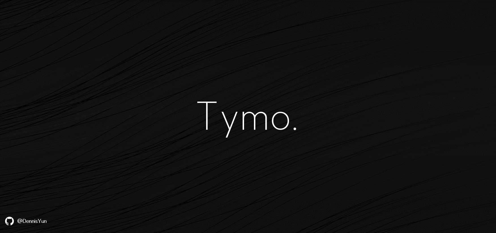

Tymo : `Type Mock`의 준말

# 개발 목적
* 고사 pdf파일의 지문을 `.json`으로 바꾸어 그 파일 내용을 `respense` 하는 `api` 구현하기.
* 모던한 `user interace` 구현하기.
* `대학수학능력시험(csat)`과 6월, 9월 `모의평가(mock)` 영어과 시험 지문에 익숙해지기.
* 영어 타자 실력 기르기.

# 개발 상황
## exams 📂
[평가원 홈페이지](https://www.suneung.re.kr/)에서 수능과 모의평가 문제지(pdf)를 다운받아 고사에 따라 [/csat](https://github.com/DennisYun/tymo/tree/main/texts/csat), [/mock/june](https://github.com/DennisYun/tymo/tree/main/texts/mock/june), [/mock/sept](https://github.com/DennisYun/tymo/tree/main/texts/mock/sept) 디렉토리에 저장.
## transformer 📂
`exams 디렉토리`에 저장된 `.pdf`파일들을 `fitz` 모듈로 읽어낸 후, 문제 번호나 특수 기호 등을 기준으로 읽어낸 문자열을 잘라 문제 번호별로 [texts 디렉토리](https://github.com/DennisYun/tymo/tree/main/texts) 내부 `.json` 파일에 저장하는 `python` 코드 작성.
## backend 📂
1. [texts 디렉토리](https://github.com/DennisYun/tymo/tree/main/texts) 내부의 `.json`을 `GitHub Page`를 활용하여 deploy.
2. [express.js](https://expressjs.com/ko/) 라이브러리를 활용하여 deploy된 api를 읽어내 `years` 파라미터와 `exams` 파라미터를 기준으로 적절한 가공을 한 후 `response`하는 api 작성.
3. 작성된 `express api`를 [vercel](https://vercel.com)을 이용하여 deploy.
## frontend 📂
`vue.js` + `TypeScript` + `SCSS` 사용
1. `SuperRadio` 컴포넌트 개발 중...

# 출처; 개발에 사용한 자료들
* [SUIT 폰트](https://sunn.us/suit/)
* [평가원 기출 문제](https://www.suneung.re.kr/boardCnts/list.do?boardID=1500234&m=0403&s=suneung)

# 스페셜 땡스 투
|번호|이름|정보|
|---|---|---|
|01|주*후|내 친구|